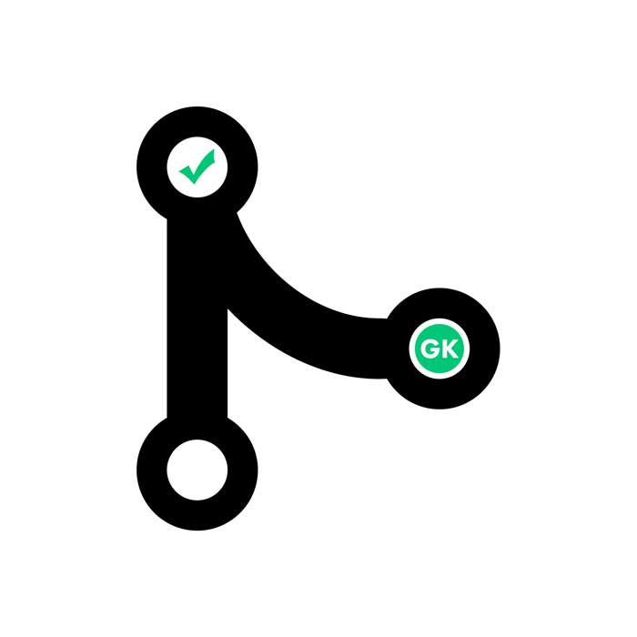

# greenkeeper-keeper

[Greenkeeper.io](https://greenkeeper.io/) is a fantastic service that makes it easy for me to keep dependencies up to date. However, I have found that on larger projects it can get a bit noisy and create quite a few PRs. While this is still preferable to the bulk update method (IMO), it's still not an ideal situation. I wanted to not have to deal with greenkeeper PRs at all unless a build fails. Hence the birth of `greenkeeper-keeper`.

The idea is simple. If a `greenkeeperio-bot` PR is valid, `greenkeeper-keeper` will merge it. Otherwise it leaves it up to you to resolve!

> **A Quick Note: I wouldn't recommend using this service unless you have good test coverage and are checking your dependencies for vulnerabilities during your build process. Not properly vetting dependencies before using them in production could lead to some serious problems (hopefully it's just unplanned down-time and not something worse).**

## Getting Set Up

### Things You Need

- GitHub Username and Personal Access Token

  To use this service you will need a GitHub username and personal access token. (**I recommend making a "bot" GitHub user and adding to the correct org/team/repo and using that user only for this service.**) These will be used as environment variables for the service.

  > **The personal access token will need the `repo` and `repo:read_hooks` scopes to work properly.

- Webhooks

  For each repository you want to use `greenkeeper-keeper` with. (**See "Setting Up Webhooks" Section Below**)

### Deploying With Heroku

Then in your application settings, set environment variables for:

- `GITHUB_USER`: GitHub username
- `GITHUB_TOKEN`: GitHub personal access token
- `SQUASH_MERGES`: Squash commits on merge (false by default)

### Setting Up Webhooks

Once your service is up and running, you will want to set up [webhooks](https://developer.github.com/webhooks) for the repositories you want `greenkeeper-keeper` to manage.

> **Make sure to check the `pull request` scope for the webhook and set the url to YOUR_HEROKU_APP_URL/payload**
